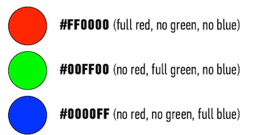

#HTML Review and Introduction to CSS

##HTML Review

#####What tag is it?
- Below is a mockup of a HTML page we will be building today.
- Think about which tags may be used to create this layout.


##HTML `img` Tag
- Images are placed on the page by the `img` tag.
- Let's take a look at how it works:

```

```

- We will try a few examples together.

##Working with Directories
- In order to link files correctly it's important to understand how directories work.
- Let's take an example of an image called puppies.jpg that is located inside of a folder called img. Let's see how the `img` tag changes as the files get moved around.
- It's also important to note that if you move a file after you make changes to it in Sublime Text you should exit Sublime Text and re-open the file.

##Using CSS with HTML
- There are three main ways to use CSS - inline styles, the `style` tag in the `head`, and a separate .css file that is linked to the HTML.
- Linking a stylesheet to the HTML document is the best-practice way to use CSS styles.
- Here is the syntax for the `link` tag:

```
<link rel="stylesheet" href="style.css" />
```

##CSS Breakdown
- Each CSS style set starts with a selector.
- Selectors allow you to identify which elements you want to apply styles to.
- Here is an example of a selector with a couple rules:

```
p {
	color: red;
	font-weight: bold;
	background-color: blue;
}
```

- This example selects all paragraph tags on the page and applies the below styles to them.

##CSS Selectors
- There are three common basic selectors in CSS.
- The first is the element selector. This is not a very specific selector:

```
div {
	color: red;
}

table {
	color: red;
}

p {
	color: red;
}
```

- The second is the id selector. By convention id's should not be used more than once per page:

```
#my-div {
	background-color: #990000;
}
```

- The third is the class selector. Classes by convention can be used multiple times throughout the page:

```
.my-divs {
	background-color: #EBEBEB;
}
```

##CSS Colors
- Colors in CSS can be defined in a few different ways.
- The first we have already seen - calling them out by their name symantically (red, green, blue, etc.)
- The second way is by using HEX colors. HEX codes represent shades of red, green, and blue.



- You can find color codes on a number of websites and other programs like Photoshop. [Colorpicker.com](http://www.colorpicker.com/) is a good example.
- Another way of defining CSS colors is via `rgba()`. Rgba accepts values for red, green, and blue as well as an alpha value for transparency.
- Each RGB value is from 0 to 255. Alpha values are from 0 to 1.

##CSS Review
- Where should CSS styles go?
- How does the CSS syntax work?
- Give examples of 3 different CSS selectors.

##About Me Code-Along
- We will now work on coding the about me page that we showed earlier.
- We will be incorporating our HTML knowledge with CSS styles to accomplish this.

##Wendy G. Bite Resume Lab / Homework
- For this exercise we will be using the mockup below to code it into HTML and CSS.
- Link the about me page we created earlier to your resume page.

