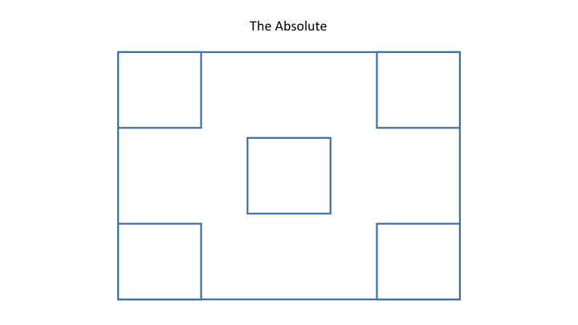

#More Layout

##CSS Positioning
- There are four main types of positioning that you will see most often - static, relative, absolute, and fixed.
- Static positioning is what all elements have by default. Yay!
- Relative and absolute work together - elements can be positioned absolutely relative to their container.
- Fixed position elements are essentially absolute relative to the window no matter where they are in the DOM. A.K.A. the window is always the relative parent.

##Positioning Exercise
- Try to replicate the following mockups using what we've talked about in this class so far.
- Utilize margins, padding, floats, positioning, etc.

1. Stackers!

2. The Mirror

3. The Skinny

4. The Absolute

##In-Class Lab / Homework
- For homework you will be creating the fashion blog using your knowledge of layouts.
- The mockup of what you will be creating can be found [here](img/fashion_blog_2.png).
- Bonus: Implement your own grid system to use in layout.
- Extra Reading: Have a look through the documentation for popular frontend frameworks such as Twitter Bootstrap or Zurb Foundation. Pay attention to how they implement the grid system.
	- [Twitter Bootstrap](http://getbootstrap.com/)
	- [Zurb Foundation](http://foundation.zurb.com/)