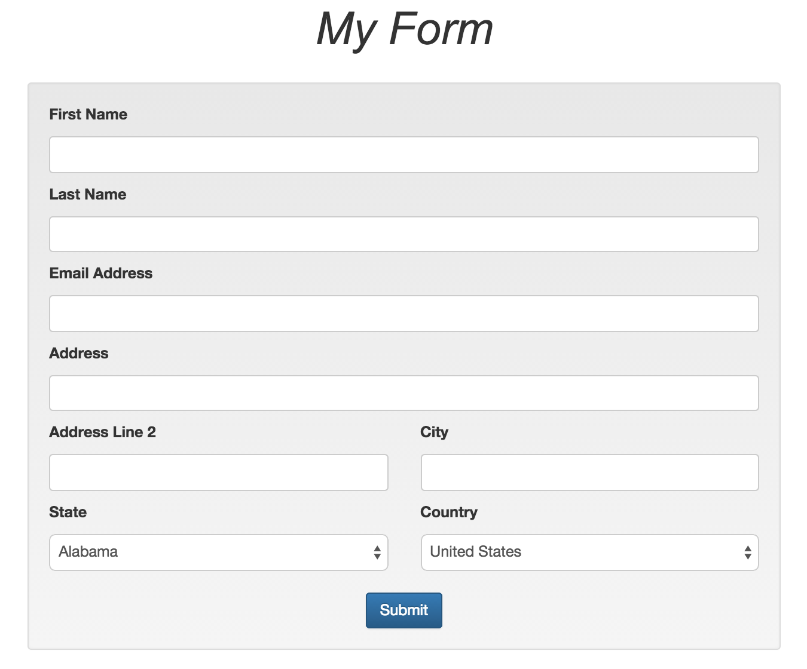

#Forms with HTML and JavaScript
- Forms are the primary means to get data from the front end to various back end systems.
- Typically when a form is submitted, the data is sent to a script on the back end that does something with it and then redirects the user to another page or back to where they were before.
- Forms generally have three pieces of information that accompany any transmission:
	- Where to send the data
	- How to send it
	- What is being sent

##The `form` Tag
- The form tag is used to enclose the form fields you want to send to the backend, as well as to contain information about where the data is going.
- Here is what a simple login `form` tag could look like:

```
<form action="/login" method="POST"></form>
```

##The `input` Tag
- The `input` tag provides a box for the user to enter information.
- With HTML5 we have many different input types available to us. Here are a few common ones:
	- `<input type="text" />`
	- `<input type="password" />`
	- `<input type="email" />`
	- `<input type="tel" />`
- While some of them may not look any different on the computer, they will open up different keyboard on a mobile device.
- Let's take a look at a demonstration using an iPhone.

##The `select` and `option` Tags
- The `select` and `option` tags go together to create dropdown lists.
- They can be hard-coded, but they are often generated dynamically via the back end service.
- Let's take a look at the syntax:

```
<select>
	<option value="CA">California</option>
	<option value="NY">New York</option>
</select>
```

##Checkboxes and Radios
- Checkboxes and radios are used to select pre-defined values from a list.
- Here are a couple examples:

```
<input type="checkbox" name="tos-agree" value="accept" />
```
and

```
<input type="radio" name="accept" value="accept" />
<input type="radio" name="accept" value="decline" />
```
- Both of these input types have hard-coded values because they are pre-defined.

##Field `name` Attributes
- Each field that you want to use to accept and transmit data will have to have a `name` attribute.
- The name attribute is essentially the parameter that identifies that piece of information to the server on the back end.
- Adding names is simple:

```
<input type="text" name="username" />
```
or

```
<select name="state">
	<option value="">Choose State</option>
	<option value="CA">California</option>
	<option value="NY">New York</option>
</select>
```

##Styling Form Fields
- Form fields have some default rendering associated with them, but it is always a good idea to overwrite that with some custom styling.
- Let's take a look at how we can apply some basic styling to create a nice uniform feel.
- Bootstrap also provides us a class called `form-control` that takes care of standardizing all of our form fields for us.

##Form Exercise
- For this exercise we will practice using form tags to create a simple form.
- Below is a mockup of what we want to accomplish. Try to replicate the same basic design using Bootstrap.
- For the states dropdown you may want to look online for a copy and paste-able script instead of having to type them all in.
- Pay attention to which input field types to use.



##Accessing Form Field Data
- Although much of the processing will likely occur on the back end, there are many reasons to use JavaScript to read the form data and do something with it.
- One of these reasons is validation - checking the form for errors before it is submitted.
- Reading data is straightforward with jQuery's `.val()` function. It can be used as a getter and a setter:

####Getter

```
$("#form-field").val();
```
####Setter

```
$("#form-field").val("New value!");
```
- Often these fields are pulled out via JavaScript into an object:

####HTML

```
<input type="text" id="username" />
<input type="password" id="password" />
<button type="button" id="submit-button">Submit</button>
```
####JS

```
$(document).on("click", "#submit-button", function() {
	var formInfo = {
		username: $("#username").val(),
		password: $("#password").val()
	};
});
```

##`event.preventDefault()`
- Most times when dealing with forms in JavaScript you want to make sure that the form is not submitted until it has been processed appropriately.
- To prevent forms from submitting automatically, we can use the `event.preventDefault()` method:

```
$(document).on("click", "#submit-button", function(event) {
	event.preventDefault();

	var formInfo = {
		username: $("#username").val(),
		password: $("#password").val()
	};
});
```

##Simple Form Validation
- This method of reading form data with JavaScript is most commonly used for form validation.
- One of the simplest checks we can make is that all fields have been filled out and not left blank.
- Here's an example using a for-in loop to check the form for blank submissions:

```
for (field in formInfo) {
	if (formInfo[field] === "") {
		alert("Please fill in all fields.");
		return false;
	}
}
```
- This loop with go through the object and check for blank entries.
- If a blank is found, and alert will be triggered and the parent function will return false. This will prevent any further action from taking place.
- When applying validation on a form using JS its common practice to set the `type` attribute of the submit button to "button". This will make sure it doesn't submit the form without going through the validation first.

##Simple Validation Exercise
- In this exercise you will add simple validation to your form you created.
- First start off by binding a click event to your submit button that will pull out all of the form fields into an object.
- Create a loop that will check each field for a blank submission.
- Prevent any further action from taking place.
- If each field is filled out, alert your user "Thanks for submitting the form!".

##Homework: Project Planning
- For the project that is due the last day of class you will be building a website with the technologies we have used so far.
- Think about a website you would like to build that incorporates HTML, CSS and JavaScript/jQuery that can be done in about a week.
- Submit your proposal via Schoology and we will review it one-on-one in class next time.

##Reading for Next Class
- Next class we will be going through [jQuery AJAX](http://api.jquery.com/jquery.ajax/).
- Look through the documentation and try some of the examples before class.